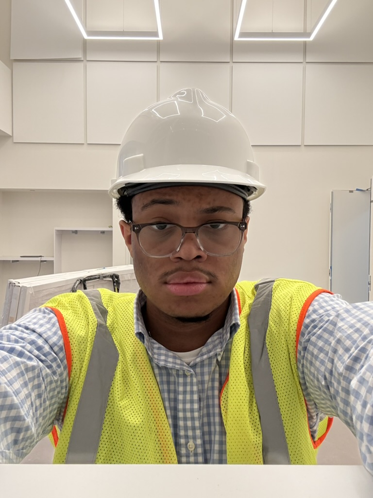

## About Me

 
My name is Benjamin Brown, and I am a junior mechanical engineering undergraduate at Cornell University. My work experience lies primarily in HVAC commissioning, with a knowledge base comprised of my time as a commissioning intern and as an undergraduate at Cornell. My experience has supported my growing interest in fluid machine design and testing, especially those seen in home or small machines such as personal computers and home HVAC systems. 

Take a look at <a href="{{ "/projects/" | relative_url }}">my projects</a> and <a href="{{ "/cv/" | relative_url }}">CV</a>.
